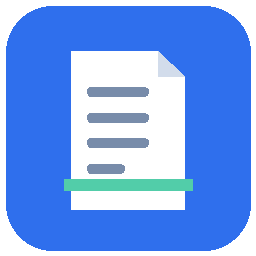
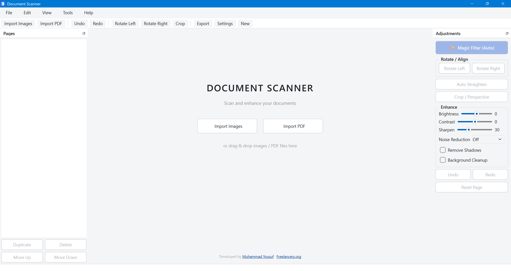
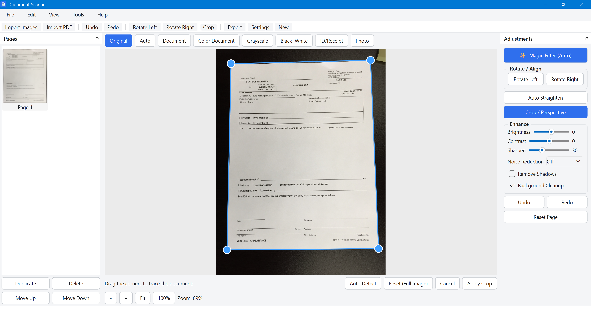
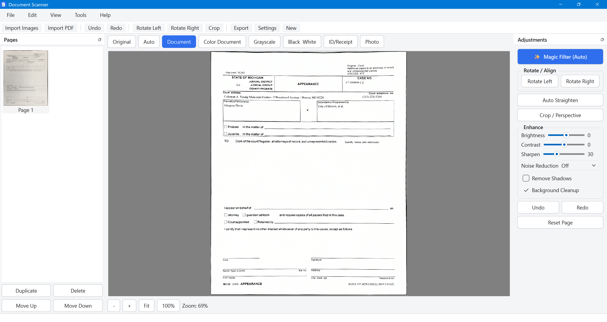
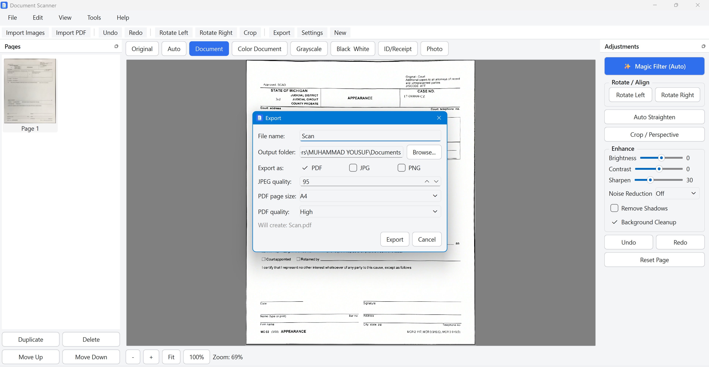
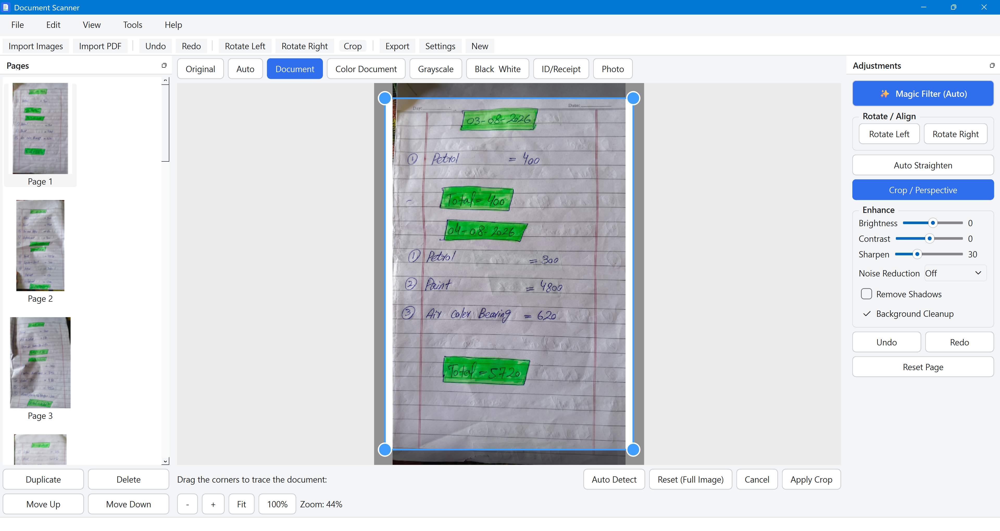

# Document Scanner

**A free document scanner for Windows.**
Turn photos and PDFs into clean, straightened, enhanced scans - no
account, no cloud, no subscription. Everything runs on your own PC.

[-orange)](LICENSE)

<!--
Once you've published a Release, you can add a live badge like:

-->

[Download](#download) · [Features](#features) · [Screenshots](#screenshots) · [FAQ](#faq) · [License](#license)

---

Document Scanner works like CamScanner, Adobe Scan or Microsoft Lens, but
as a native Windows desktop app: import a photo or PDF, let it
auto-detect and straighten the page (or crop it by hand), pick an
enhancement preset, and export a clean JPG/PNG or a combined PDF. All
processing happens locally - nothing you scan is ever uploaded anywhere.

**Document Scanner is free to download and use. It is closed-source
software** - this repository hosts the app for public download; the
source code itself is not published. See [License](#license) for details.

## Features

- 📥 **Import** single or multiple images (JPG, PNG, BMP, TIFF) or an existing PDF
- 🪄 **Magic Filter** - one click to detect the document edges, correct
  perspective, auto-straighten skew, and apply the Document enhancement,
  in the spirit of CamScanner's automatic mode
- ✂️ **Interactive crop & perspective correction** with draggable corners,
  plus manual fallback whenever auto-detection isn't confident
- 🔄 Rotation (90°/180°/270°) and one-click auto-straighten
- 🎨 **8 enhancement presets** - Original, Auto, Document (default), Color
  Document, Grayscale, Black & White, ID/Receipt, Photo - with an
  **"Apply to All Pages"** shortcut
- 🎚️ Manual brightness, contrast, sharpening and noise-reduction controls
- 🌤️ Shadow removal and background whitening
- ↩️ **Non-destructive editing** with full undo/redo, per page
- 🗂️ Page thumbnails with drag-and-drop reordering, duplicate, delete
- ⚡ Batch processing with a progress bar - the UI never freezes
- 📤 Export to JPG/PNG (auto-numbered) or a combined multi-page PDF (A4 /
  Letter / Original / Auto sizing)
- 🖱️ Drag-and-drop import straight into the window
- 🔒 **100% offline** - local JSON settings only, no account, no cloud, no database

## Screenshots

| | |
|---|---|
| **Main window**    | **Editor workspace**    |
| **Magic Filter**    | **Export options**    |
| **PDF Enhance**    | |

## Download

1. Go to the [Releases](../../releases) page.
2. Download the latest `DocumentScannerSetup.exe`.
3. Run it and follow the installer - it adds a Start Menu shortcut and an
   optional Desktop icon.

> Windows may show a "Windows protected your PC" SmartScreen prompt the
> first time you run an installer from a new publisher - this is normal
> for independently distributed software. Click **More info → Run
> anyway** to continue.

**Requirements:** Windows 10 or 11 (64-bit). Nothing else to install -
everything the app needs is bundled inside the installer.

## FAQ

**Is it really free?**
Yes - free to download and use, for personal or commercial purposes.

**Is it open source? Can I see/modify the code?**
No. Document Scanner is closed-source freeware: you're welcome to use
the compiled application, but the source code is not published, and
reverse engineering, modifying, or redistributing the app is not
permitted. See [License](#license).

**Does it upload my documents anywhere?**
No. All scanning, cropping, and enhancement happens locally on your PC.
Nothing is ever sent to a server.

**I found a bug / have a feature request.**
Please [open an issue](../../issues) - bug reports and feature requests
are very welcome, even though the source isn't public.

**Can I contribute code?**
Since the project is closed-source, we don't accept pull requests. If
you're interested in custom development, integrations, or a commercial
license, reach out via [Freelancery](https://freelancery.org/).

## License

Document Scanner is **freeware, not open source**. You may download and
use the compiled application free of charge, but the source code is
proprietary and not distributed. Reverse engineering, modifying, or
redistributing the software is not permitted.

Full terms: [LICENSE](LICENSE).

## Credits

Developed by [Muhammad Yousuf](https://github.com/myousufsoomro/)
in collaboration with [Freelancery](https://freelancery.org/).
